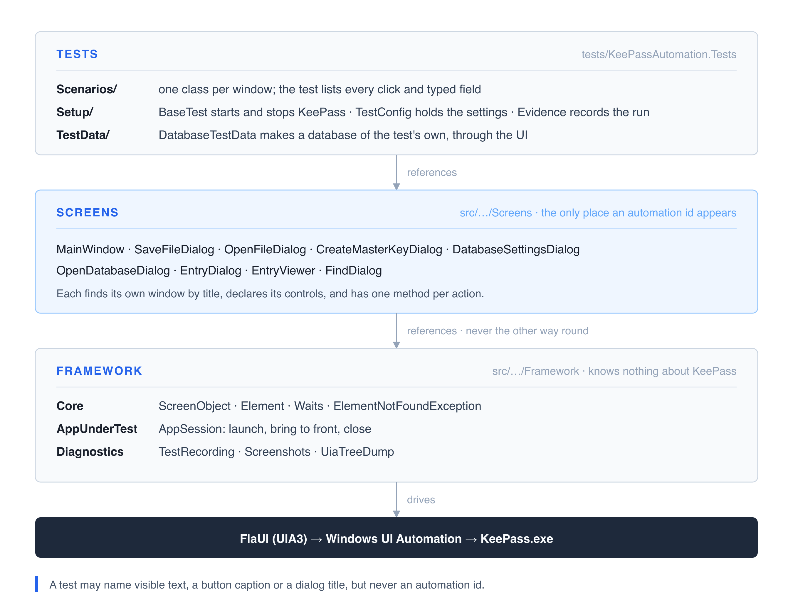

# KeePass UI automation

Desktop UI tests for [KeePass 2.x](https://keepass.info/), built with FlaUI and NUnit.

[](https://github.com/ramindusn/keepass-ui-automation/actions/workflows/ci.yml)
[](https://ramindusn.github.io/keepass-ui-automation/)

The application under test is a means to an end. What this repository is really about is the
framework: how screens, tests, settings and evidence are arranged so that the suite stays
readable as it grows, and so that a failure on a machine nobody is watching can still be
diagnosed.

|  |  |
|---|---|
| **Application under test** | KeePass 2.61.1, downloaded and checksum-verified by a script, never committed |
| **Driver** | FlaUI 5 over Windows UI Automation (UIA3) |
| **Tests** | NUnit 4, five scenarios, a fresh KeePass per test |
| **Evidence** | A video of every test; a screenshot and the UIA tree of every failure |
| **Reporting** | Allure, published to GitHub Pages after every run on `main` |
| **CI** | GitHub Actions: style check on Linux, then the suite on Windows |

## How it fits together



- **Tests** read as a sequence of steps. A test creates the screens it needs in `BeforeEach`,
  then names every click and typed field. Nothing is hidden between a line and the click it makes.
- **Screens** are one class per window or dialog. A screen finds its own window by title when an
  action is called, declares its controls once, and offers one method per action. It never drives
  another screen.
- **The framework** knows nothing about KeePass. Point it at another Windows application and it
  still compiles.

Dependencies run one way, and one rule keeps the top layer honest: a test may name visible text,
such as a button caption or a dialog title, but never an automation id.

```bash
grep -r "ByAutomationId" tests/     # returns nothing
```

<details>
<summary>Project layout</summary>

```
src/KeePassAutomation.Library/
  Framework/
    AppUnderTest/   AppSession: launch, bring to front, close
    Core/           ScreenObject, Element, Waits, ElementNotFoundException
    Diagnostics/    TestRecording, Screenshots, UiaTreeDump
  Screens/          MainWindow and Dialogs/, the only place locators live
tests/KeePassAutomation.Tests/
  Scenarios/        the tests, one class per window
  Setup/            BaseTest, TestConfig, Evidence
  TestData/         DatabaseTestData
  Traceability/     the Requirement attribute
tools/              fetch scripts, requirement coverage check
requirements.json   what the application must do
```

</details>

## Quick start

> [!NOTE]
> The tests need **Windows**, because FlaUI drives the Windows UI Automation API. The projects
> also compile on macOS and Linux, so the build and the style check run anywhere.

You need the .NET SDK pinned in `global.json` and PowerShell 7 (`pwsh`).

```bash
pwsh tools/Get-KeePass.ps1     # fetch the pinned KeePass into .keepass/
pwsh tools/Get-FFmpeg.ps1      # fetch ffmpeg, used to record the tests
dotnet test                    # the whole suite, about a minute
```

Run part of it:

```bash
dotnet test --filter Category=Smoke                   # the app starts and its core path works
dotnet test --filter FullyQualifiedName~EntryTests    # one window's tests
```

Point the suite at an installed copy instead of the fetched one by setting `KEEPASS_EXE` to the
path of any `KeePass.exe`.

## The report

Every test writes an Allure result and a video. A failed test also attaches a screenshot and the
UIA tree of the window as it was at the moment of failure, which is usually enough to find the
cause without reproducing it.

```bash
npm install --global allure-commandline
allure serve tests/KeePassAutomation.Tests/bin/Debug/net8.0-windows/allure-results
```

The report for `main` is published on every run:
**[ramindusn.github.io/keepass-ui-automation](https://ramindusn.github.io/keepass-ui-automation/)**

Each test names the requirement it verifies, so the report shows it twice: the **Behaviors** view
groups tests under their requirements, which is the traceability matrix, and a test's own entry
states the requirement above its evidence. On CI a requirement with no test fails the build.

## Settings

Everything a run can be tuned with is in `tests/KeePassAutomation.Tests/Setup/TestConfig.cs`: the
output folder, the timeouts, whether to record video, what to capture on failure. Change a value
there and nothing else needs to change.

## Adding a test

**1. Find or add the screen.** If the window already has a class in `Screens/`, add the action you
need as one method. If not, add a class deriving from `ScreenObject` that passes its window title to
the base, declares its controls with `ById(...)`, and has one method per action. Automation ids
come from the `DumpUiaTree` diagnostic (`dotnet test --filter Name=DumpUiaTree`) or from
Accessibility Insights.

**2. Write the test.** Derive from `BaseTest`, create the screens in `BeforeEach`, and write the
steps. If the test needs a database, create `DatabaseTestData` in `BeforeEach` and delete it in
`AfterEach`.

```csharp
public class SearchTests : BaseTest
{
    private MainWindow _mainWindow;
    private FindDialog _findDialog;
    private DatabaseTestData _database;

    [SetUp]
    public void BeforeEach()
    {
        _mainWindow = new MainWindow(Session);
        _findDialog = new FindDialog(Session);

        _database = new DatabaseTestData(Session);
        _database.CreateSavedDatabase();
    }

    [TearDown]
    public void AfterEach()
    {
        _database.Delete();
    }

    [Test]
    [Requirement("REQ-005", "Searching by title finds the matching entry")]
    public void SearchFindsTheMatchingEntry()
    {
        _mainWindow.ClickMenuItem("Find", "Find...");
        _findDialog.SetSearchText("#2");
        _findDialog.ClickOk();
        _mainWindow.WaitForEntryRow("Sample Entry #2");

        Assert.That(_mainWindow.EntryTitles, Is.EquivalentTo(new[] { "Sample Entry #2" }));
    }
}
```

**3. Name the requirement.** Add it to `requirements.json` and put `[Requirement("REQ-00x", "…")]`
on the test. Add `[Category("Smoke")]` if it belongs in the quick subset.

**4. Open a pull request.** Style is enforced by the build, so `dotnet format --verify-no-changes`
has to pass. Open an issue for the task first: the branch is `kp-<n>-<slug>`, and every commit and
the pull request title read `type(KP-<n>): description`, where `<n>` is the issue number.
