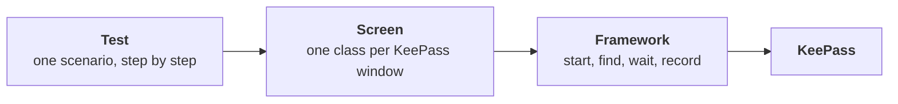
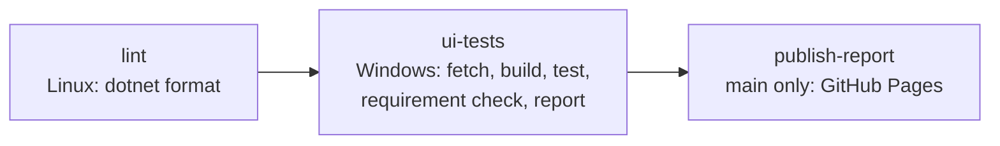

# KeePass UI automation

Desktop UI tests for [KeePass 2.x](https://keepass.info/), written in C# with FlaUI and NUnit.

[](https://github.com/ramindusn/keepass-ui-automation/actions/workflows/ci.yml)
[](https://ramindusn.github.io/keepass-ui-automation/)

| What | Tool | How |
|---|---|---|
| Application | KeePass 2.61.1 | Downloaded and checksum-verified by a script, never committed |
| Driver | FlaUI 5 | Windows UI Automation |
| Tests | NUnit 4 | A fresh KeePass for every test |
| Evidence | FlaUI and ffmpeg | A video of every test, plus a screenshot and the UI tree of every failure |
| Report | Allure | Published to GitHub Pages on every run of `main` |
| CI | GitHub Actions | Style check on Linux; smoke tests on pull requests, all tests on `main`, on Windows |

## How it fits together



A **test** is a short list of steps followed by an assert. Every step is one call on a screen, so the test reads like the manual test case it came from.

A **screen** is one class for one KeePass window or dialog. It knows that window's controls and offers one method per action, such as `TypePassword` or `ClickOk`. Automation ids live here and nowhere else.

The **framework** does the work that is the same for every screen: it starts KeePass before a test and stops it after, finds windows and controls, waits for them to appear, and records the video, the screenshot and the UI tree.

One step, top to bottom:

```
_openDatabaseDialog.TypePassword(password)     test: one step
  _password.Type(password)                     screen: the password box on the Open Database dialog
    Find("m_tbPassword")                       framework: wait for the control, up to 10 s, then type
```

Tests are in `tests/KeePassAutomation.Tests/Scenarios`, screens in `src/KeePassAutomation.Library/Screens`, and the framework in `src/KeePassAutomation.Library/Framework`.

## Run it

The tests need **Windows**.

You need the .NET SDK from `global.json` and PowerShell 7.

```bash
pwsh tools/Get-KeePass.ps1     # KeePass into .keepass/
pwsh tools/Get-FFmpeg.ps1      # ffmpeg, records the videos
dotnet test                    # the whole suite, about a minute
```

```bash
dotnet test --filter Category=Smoke                   # the quick subset
dotnet test --filter FullyQualifiedName~EntryTests    # one window
```

All settings are in `tests/KeePassAutomation.Tests/Setup/TestConfig.cs`: output folder, timeouts, video, what to capture on failure.

## A test

```csharp
[Test]
[Requirement("Searching by title finds the matching entry", 20)]
public void SearchFindsTheMatchingEntry()
{
    _mainWindow.ClickMenuItem("Find", "Find...");
    _findDialog.SetSearchText("#2");
    _findDialog.ClickOk();
    _mainWindow.WaitForEntryRow("Sample Entry #2");

    Assert.That(_mainWindow.EntryTitles, Is.EquivalentTo(new[] { "Sample Entry #2" }));
}
```

`BaseTest` starts KeePass before each test and kills it after. Screens are created in `BeforeEach`.

## Evidence and report

Every test records a video. A failed test also saves a screenshot and the UI tree of the window at that moment. All of it is attached to the test in the report.

```bash
npm install --global allure-commandline
allure serve tests/KeePassAutomation.Tests/bin/Debug/net8.0-windows/allure-results
```

The report for `main` is live at **[ramindusn.github.io/keepass-ui-automation](https://ramindusn.github.io/keepass-ui-automation/)**. It shows the trend across runs, links each run to its workflow run, and names the KeePass version and runner it ran on.

### On a pull request

A pull request runs only the smoke tests, and its report is not published. Every run uploads two artifacts, and you can see them at the bottom of the run's **Summary** page in Actions:

| Artifact | Contains |
|---|---|
| `allure-report` | The report for that run |
| `test-evidence` | The videos, screenshots and UI trees as plain files |

The report does not open by double-clicking `index.html`. Unzip it and serve the folder:

```bash
unzip allure-report.zip -d allure-report
cd allure-report
python3 -m http.server 8080     # then open http://localhost:8080
```

### After merge

When a pull request is merged, `main` runs the full test suite and publishes its report to the [live Allure report](https://ramindusn.github.io/keepass-ui-automation/).

## CI



Pull requests run the smoke tests. `main` runs every test.

The report and the evidence are produced even when tests fail, which is when they matter.

Rules on `main`:

- Every change goes through a pull request. Squash merge only.
- `lint`, `ui-tests` and `commit-lint` must pass.

## Adding a test

1. **Screen.** Add a method to the window's class in `Screens/`, or a new class deriving from `ScreenObject` that passes its window title and declares its controls with `ById(...)`. Use `ByName(...)` when an id is not unique.
2. **Test.** Derive from `BaseTest`, create the screens in `BeforeEach`, write the steps.
3. **Requirement.** Put `[Requirement("<wording>", <issue number>)]` on the test. Add `[Category("Smoke")]` if it belongs in the quick subset.
